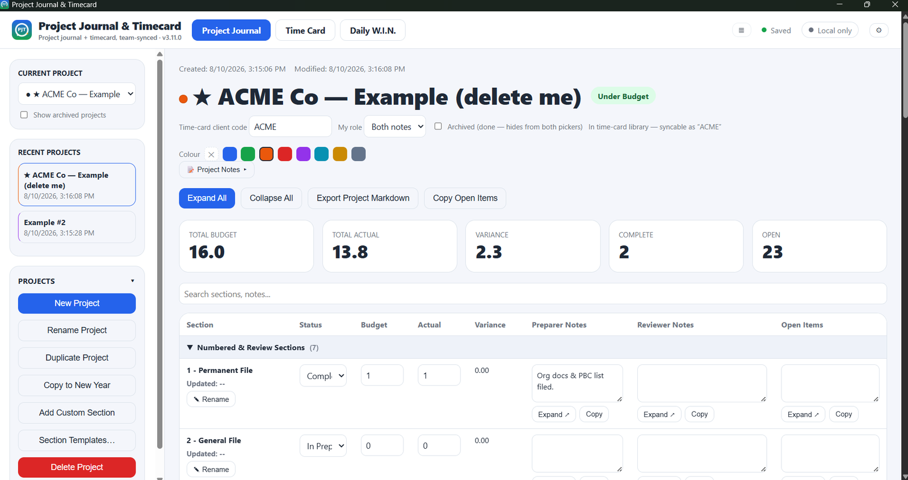
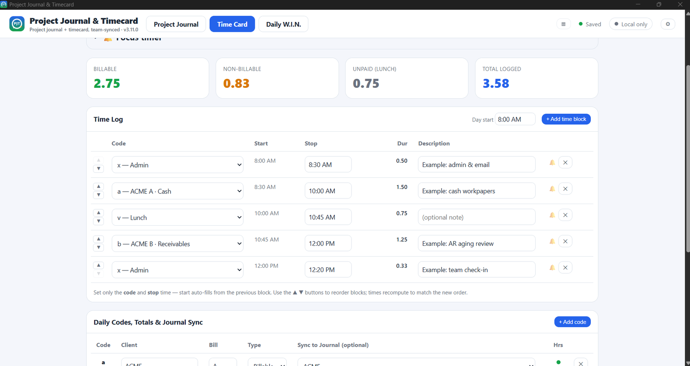
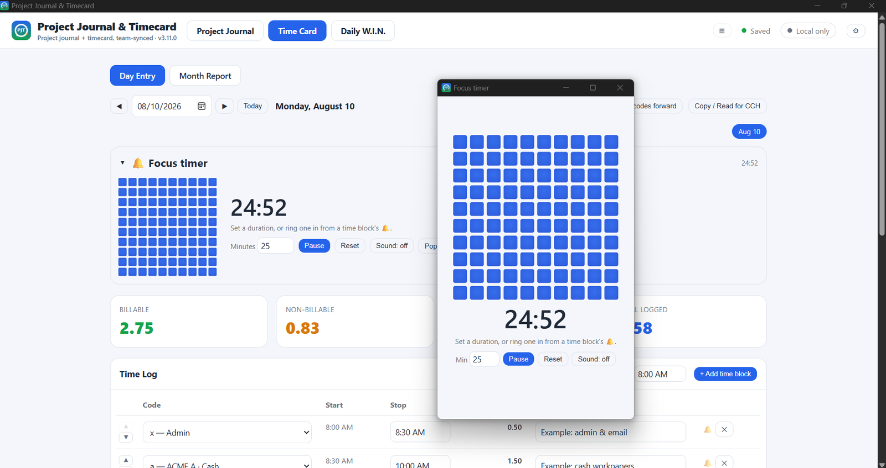
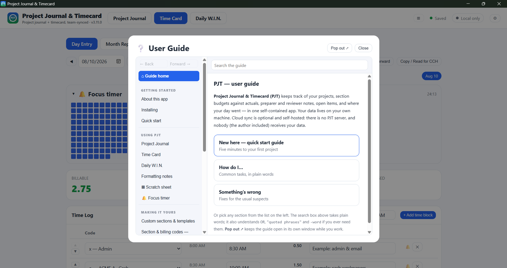

# Project Journal & Timecard

**Workpaper tracking and daily time logging for an audit practice — in a single HTML file.**

[](https://github.com/projectjournalandtimecard-PJT/project-journal-and-timecard/actions/workflows/build.yml)
[](LICENSE)

PJT tracks project sections against budget, keeps preparer and reviewer notes where you can
find them, collects open items into something you can paste into an email, and logs your day
without making you type a single start time.

There is no server, no account, and no company receiving your data — including the author's.
Your journal is a JSON file on your own machine.

**[Download the latest release →](https://github.com/projectjournalandtimecard-PJT/project-journal-and-timecard/releases/latest)**



---

## What it does

**Project Journal.** Every workpaper section gets a status, a budget, an actual, an automatic
variance, and three note fields — preparer, reviewer, open items. Section names sort themselves
into groups by their leading letter, so `B - Receivables` files itself under Assets. Stat cards
total the project live.

Start from the built-in audit template, a blank project, or a template you've saved from a
project whose section list you liked. *Copy to New Year* clones a project with actuals cleared
and archives last year's.

**Time Card.** Set the code and the stop time. That's it — each block starts where the previous
one ended, so the day is a chain rather than a list of ranges. Reorder blocks with ▲▼ and every
time recomputes itself. Hours on a code linked to a project section roll into that section's
actual automatically, and re-syncing a day replaces its contribution rather than double-counting.



**Daily W.I.N.** A short "What's Important Now" list per day. Deliberately small.

**Pocket tools.** A **scratch sheet** — an 8×25 grid with formulas, arrow-key point mode, and
copy/paste that moves real cells to and from Excel. And a **focus timer** that pops out into its
own always-on-top window and can be started from any time block.



**A guide that answers questions.** Nineteen sections, full-text search with `OR`, `"phrases"`
and `-exclusions`, and three doors on the front page for the three states people actually arrive
in. It pops out into its own window so you can read it while you work.



---

## Installing

Grab the installer for your platform from the
[latest release](https://github.com/projectjournalandtimecard-PJT/project-journal-and-timecard/releases/latest):
a `.exe` for Windows or a `.dmg` for Apple Silicon Macs.

The installers are **unsigned**, so both operating systems will ask you to confirm before running
one. A signing certificate is a yearly cost and this is a free tool. The prompt means the
publisher could not be verified automatically — not that a check found a problem with the file.

- **Windows** — if a blue box appears, click *More info*, then *Run anyway*.
- **macOS** — if the app doesn't open on a double-click, right-click it in Applications and choose
  *Open*. macOS describes unsigned apps as "damaged", which refers to the missing signature rather
  than the file. If that doesn't work:
  `xattr -dr com.apple.quarantine "/Applications/Project Journal & Timecard.app"`

If unsigned software isn't permitted where you work, the entire application is one readable file
and you can build it yourself — see below.

**Or don't install anything.** Download `src/index.html`, open it in a browser, and the whole app
runs. Data goes to browser storage instead of a file, which is partitioned per browser profile —
the desktop build avoids that.

---

## Your data

Your journal lives at a path the app shows you under ⚙ → *Local storage*, alongside a `backups`
folder holding the last 30 daily snapshots. Export a JSON backup any time. Uninstalling doesn't
touch it.

**Cloud sync is optional and self-hosted.** If you want two machines or a small team to share a
journal, PJT syncs through *your own* GitHub gist using a token you create. There is no PJT
server in the middle.

Two things stated plainly, because this is an accounting tool:

- Synced content is stored as **readable JSON** in your gist. A secret gist is unlisted, not
  private. Keep client-identifying detail out of anything that syncs — section budgets, hours and
  statuses are fine; client names and financial figures are not. The guide's Privacy section
  covers this properly.
- The optional passphrase encryption protects the file **on your disk**, against a lost or stolen
  laptop. It does not encrypt what you sync.

---

## Built from one file

`src/index.html` is the entire application — HTML, CSS and JavaScript inline. No framework, no
build step, no dependencies, no bundler, no `node_modules`. Open it in a browser and it runs.

The desktop apps are that same file wrapped in a [Tauri 2](https://tauri.app) shell, built by
GitHub Actions on Windows and macOS runners. Nothing is compiled from the app's own source; the
file that ships is the file in the repo.

This isn't a stunt. It's what makes the app durable: there's no toolchain to rot, no dependency
to be abandoned, and any future maintainer can read the whole thing top to bottom. Encryption is
Web Crypto, storage is a JSON file, sync is one HTTP call to the GitHub API.

**Building it yourself:**

```bash
git clone https://github.com/projectjournalandtimecard-PJT/project-journal-and-timecard
cd project-journal-and-timecard
cargo install tauri-cli --version "^2.0" --locked
cargo tauri build --bundles nsis   # or: --bundles dmg on macOS
```

Or fork it and push — the workflow builds both installers on every commit to `main`, and attaches
them to a release when you push a `v*` tag.

---

## Stuck?

The in-app guide is the first stop — ⚙ → *Guide*, or press `G`. If it doesn't cover your problem,
Help → **Get AI help** generates a description of PJT and your installation that you can paste
into any AI assistant. It contains counts only: how many projects, whether sync is on. Never
project names, client codes, note text, or credentials. You see the exact text before anything is
copied.

Otherwise, [open an issue](https://github.com/projectjournalandtimecard-PJT/project-journal-and-timecard/issues).

---

## License

MIT — see [LICENSE](LICENSE). Use it, change it, ship it. No warranty.

Built by Chad Stewart, a CPA who wanted his workpaper tracking and his time card to be the same
piece of software.
